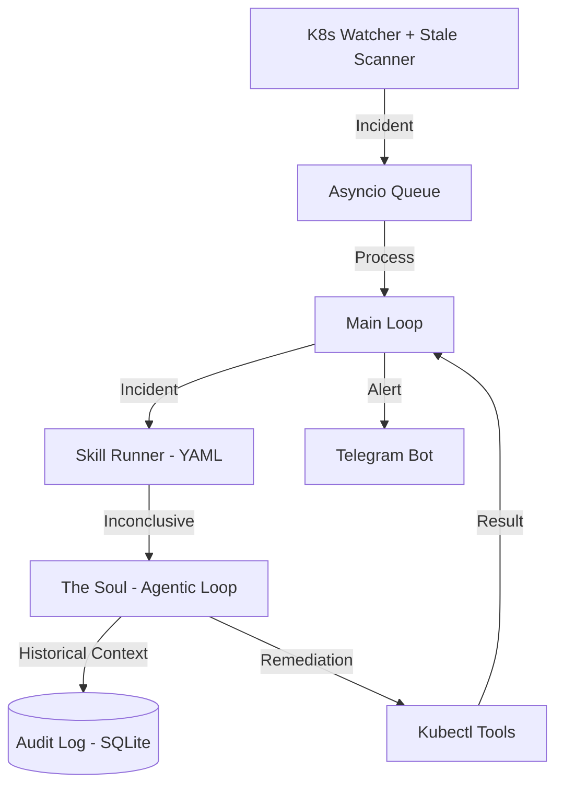

# Claw8s Architecture 🦅🏗️

Claw8s is an autonomous Kubernetes remediation agent that combines deterministic operational knowledge (**Skills**) with open-ended LLM reasoning (**The Soul**) and historical memory.

## 1. The Core Event Loop

Claw8s operates as a high-performance event processor. It watches the Kubernetes event stream and proactively scans for stuck resources.

## 2. The Hybrid Reasoning Model

### Tier 1: Skills (Runbooks)
Skills are the first line of defense. They are deterministic procedures defined in YAML.
*   **Goal**: Solve common, well-understood problems (e.g., OOMKills, known probe failures) instantly without using expensive LLM reasoning.
*   **Remediation**: Skills can now take direct action (e.g., patching a deployment) and recycle pods.

### Tier 2: The Soul (Agentic Reasoning)
If a Skill is "Inconclusive," the incident is escalated to the Soul.
*   **Goal**: Solve novel or complex problems using a multi-turn tool-calling loop.
*   **Memory Awareness**: The Soul queries the Audit Log for the last 2 hours of actions taken on the target object. It will never repeat a failing strategy.

## 3. Data Persistence & Analytics

### Audit Log (SQLite)
Every thought, event, and tool call is recorded.
*   **Prevention**: Used by the Soul to prevent remediation loops.
*   **Observability**: Powers the Dashboard and Telegram alerts.
*   **Retention**: Automatically purges data older than 30 days to stay lean.

### Integrated Dashboard
A FastAPI server integrated directly into the main process.
*   **Real-time List**: A chronological, auto-refreshing list of incidents.
*   **Frequency Analytics**: A histogram showing incident spikes over time (15m, 1h, 1d buckets).
*   **Direct Control**: Includes a "Clear History" feature for cluster operators.

## 4. Safety Controls

*   **Namespace Protection**: Mutating tools refuse to touch `kube-system` unless explicitly allowed.
*   **Threshold-Based Autonomy**: Actions with confidence < 85% require human approval via Telegram.
*   **Resource Capping**: Scaling is hardware-limited (e.g., max 20 replicas) to prevent runaway costs.
*   **Tool Aliasing**: Multi-parameter aliasing ensures the agent doesn't fail due to minor nomenclature errors (e.g., `pod_name` vs `name`).
