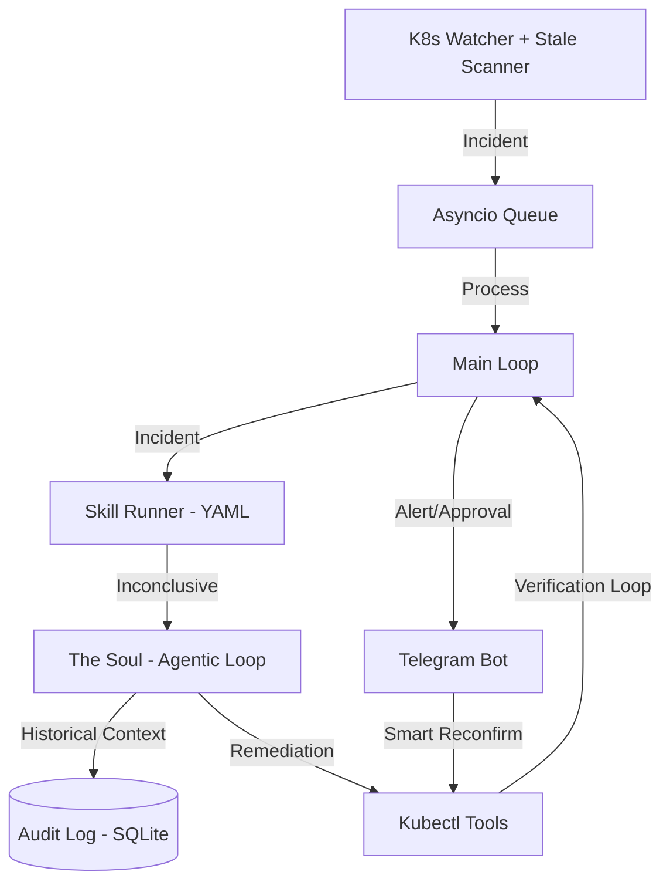

# Claw8s Architecture 🦅🏗️

Claw8s is an autonomous Kubernetes remediation agent that combines deterministic operational knowledge (**Skills**) with open-ended LLM reasoning (**The Soul**) and historical memory.

## 1. The Core Event Loop

Claw8s operates as a high-performance event processor. It watches the Kubernetes event stream and proactively scans for stuck resources.

## 2. Concurrent Boot Sequence

Claw8s uses a **Concurrent Startup Architecture** to ensure high availability:
*   **Background Boot**: The Telegram Bot is spawned as an independent background task. This prevents the entire system from hanging if the Telegram API is slow or unreachable.
*   **Instant Monitoring**: The Watcher and Incident Processor come online immediately, regardless of external service status.

## 3. The Hybrid Reasoning Model

### Tier 1: Skills (Runbooks)
Skills are the first line of defense. They are deterministic procedures defined in YAML.
*   **Goal**: Solve common, well-understood problems instantly without using expensive LLM reasoning.

### Tier 2: The Soul (Agentic Reasoning)
If a Skill is "Inconclusive," the incident is escalated to the Soul.
*   **Verification Policy (Wait for Rollout)**: The Soul is strictly prohibited from declaring an incident "Resolved" until it has confirmed via live probes that the new pods are `Ready` and `Available`.
*   **Gemini Protocol Guard**: Multi-turn history is automatically sanitized to ensure compliance with strict LLM API schemas.

## 4. Resilience & Anti-Flooding

### Controller-Aware Debouncing
Claw8s prevents "Incident Storms" by grouping pod-level failures at the parent level (Deployment or ReplicaSet).

### Proactive Condition Scanning
The system sweeps the cluster every 30 seconds, looking for "zombie" pods stuck in conditions like `PodScheduled=False`.

## 5. Observability & Control

### Smart Reconfirm Loop
The Telegram Bot features an intelligent **Reconfirm** button. When clicked, it triggers a live Kubernetes health probe to verify if the issue still exists (e.g., checking `ready_replicas`). This allows the system to automatically recognize manual fixes.

### Namespace-Aware Status
The `/status` and `/refresh` commands provide a categorized breakdown of pod health by namespace, filtering out system noise while highlighting unhealthy resources cluster-wide.

## 6. Safety Controls

*   **Namespace Protection**: Mutating tools refuse to touch `kube-system` autonomously.
*   **Threshold-Based Autonomy**: Actions with confidence < 85% require human approval.
*   **64-Byte Callback Compression**: Telegram button data is hashed and mapped to internal memory to stay within strict API limits.
