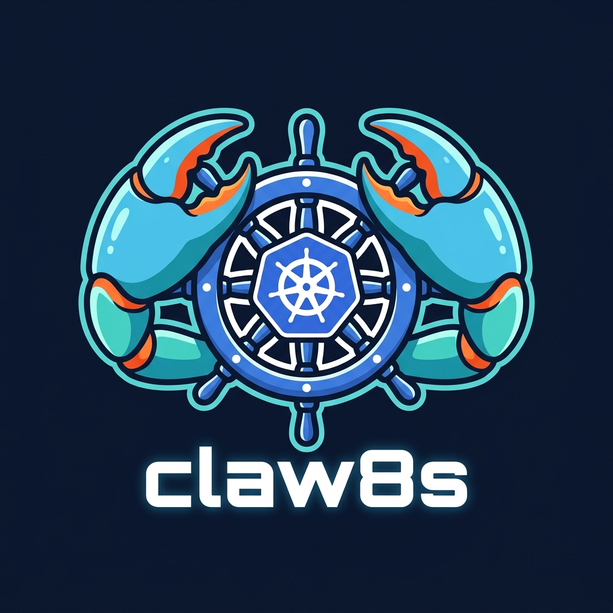

<p align="center">
  
</p>

<p align="center">
  Autonomous Kubernetes monitoring and remediation agent powered by Claude.
</p>

<p align="center">
  <b>Detects</b> K8s incidents &rarr; <b>diagnoses</b> root cause &rarr; <b>acts</b> (with your approval) &rarr; <b>notifies</b> you via Telegram.
</p>

---


## Architecture

```
K8s Watch API
     │
     ▼
 KubernetesWatcher (background thread, debounced)
     │
     ▼
 asyncio incident queue
     │
     ▼
 Claw8sAgent (Claude tool-calling loop)
     │   ├── get_pod_logs
     │   ├── describe_pod
     │   ├── list_pods
     │   ├── get_deployment_status
     │   ├── get_node_status
     │   ├── restart_deployment  ⚠️
     │   ├── scale_deployment    ⚠️
     │   ├── delete_pod          ⚠️
     │   └── cordon_node         ⚠️
     │
     ▼
 TelegramBot  ←→  You
     │
     ▼
 AuditLog (SQLite)
```

⚠️ = mutating action, requires Telegram approval if confidence < threshold

---

## Quick Start

```bash
# 1. Clone and install
cd claw8s
python -m venv .venv && source .venv/bin/activate
pip install -e .

# 2. Set up secrets
cp .env.example .env
# Edit .env with your ANTHROPIC_API_KEY and TELEGRAM_BOT_TOKEN

# 3. Configure
cp config.yaml.example config.yaml
# Edit config.yaml — at minimum set your Telegram user ID

# 4. Run
python main.py --config config.yaml
# or if installed: claw8s --config config.yaml
```

### Getting a Telegram Bot Token
1. Message [@BotFather](https://t.me/BotFather) on Telegram
2. `/newbot` → follow prompts → copy the token
3. Message [@userinfobot](https://t.me/userinfobot) to find your user ID
4. Put both in your `.env` and `config.yaml`

---

## Configuration

| Key | Default | Description |
|-----|---------|-------------|
| `watcher.watch_all_namespaces` | `true` | Watch all namespaces |
| `watcher.debounce_seconds` | `120` | Cooldown between same-incident triggers |
| `watcher.trigger_reasons` | (list) | K8s event reasons that trigger the agent |
| `agent.model` | `claude-opus-4-5` | Anthropic model to use |
| `agent.auto_remediate_threshold` | `0.85` | Confidence below this → ask for approval |
| `agent.max_tool_calls` | `10` | Max tool calls per incident (safety cap) |
| `telegram.allowed_user_ids` | `[]` | Telegram user IDs allowed to control the bot |

---

## Extending

### Adding a new tool

```python
# In tools/kubectl.py (or a new file in tools/)
from tools.registry import registry, ToolResult

@registry.tool(
    name="my_tool",
    description="What this tool does",
    parameters={
        "properties": {
            "namespace": {"type": "string"},
        },
        "required": ["namespace"],
    },
    is_destructive=False,  # True = will require approval if confidence is low
)
async def my_tool(namespace: str) -> ToolResult:
    # ... do something
    return ToolResult(success=True, output="done")
```

---

## Safety

- `kube-system` namespace is always protected from mutating actions
- Scale is capped at 0–20 replicas
- All actions are logged to SQLite with full reasoning chain
- Destructive actions below confidence threshold require your Telegram approval
- 5-minute approval timeout → auto-rejected

---

## File Structure

```
claw8s/
├── agent.py           ← Claude agentic loop
├── audit.py           ← SQLite audit log (async)
├── config.py          ← Config loading (env + yaml)
├── main.py            ← Entry point + wiring
├── watcher.py         ← K8s event watcher (debounced)
├── bot/
│   └── telegram.py    ← Telegram bot (alerts + approval)
├── tools/
│   ├── registry.py    ← Tool decorator + dispatch
│   └── kubectl.py     ← K8s tools (read + mutate)
├── config.yaml.example
├── .env.example
└── pyproject.toml
```
