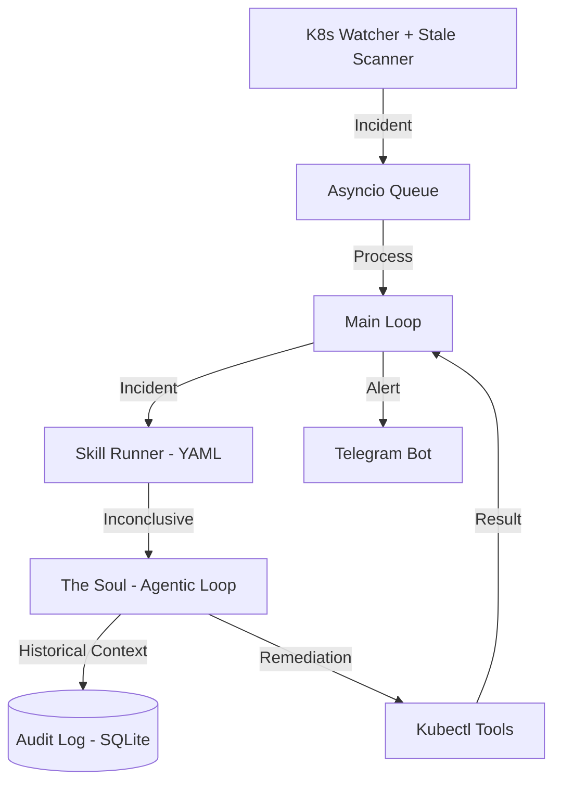

<p align="center">
  
</p>
<h1 align="center">claw8s</h1>
<p align="center">
  Autonomous Kubernetes monitoring and remediation agent powered by LLMs (Claude, GPT, Gemini, Ollama).
</p>

<p align="center">
  <b>Detects</b> K8s incidents &rarr; <b>diagnoses</b> root cause &rarr; <b>acts</b> (with your approval) &rarr; <b>notifies</b> you via Telegram.
</p>

---

## Architecture

Claw8s uses a hybrid intelligence model that combines deterministic **Skills** with an open-ended agentic **Soul** and historical memory.



---

## 🧠 Hybrid Intelligence: Soul + Skills

1.  **Tier 1: Skills (Deterministic YAML)**  
    Claw8s first matches incidents against **Skills** in `skills/`. Skills are YAML-defined runbooks that execute fixed investigation steps. They are **fast, cheap, and predictable**.
2.  **Tier 2: The Soul (Reasoning Loop)**  
    If no skill matches or is inconclusive, the **Agentic Loop** takes over. Guided by the **Soul** (`prompts/soul.md`), it uses open-ended tool calling and **Historical Memory** to resolve novel incidents.

---

## 🛡️ Resilience Features

*   **Grouped Debouncing**: Prevents alert flooding by grouping pod incidents at the Deployment/Controller level.
*   **Proactive Scanning**: Sweeps the cluster every 30s for Scheduler-level failures (e.g., Unschedulable pods).
*   **Safety Governors**: Built-in 10s timeouts on log retrieval and 20s database timeouts to prevent agent hangs.
*   **Integrated Dashboard**: A real-time analytics suite served directly from the main application.

---

## 🚀 Quick Start

### 1. Install Dependencies
```bash
uv pip install -e .
```

### 2. Set up Secrets
Edit `.env` with your `ANTHROPIC_API_KEY` and `TELEGRAM_BOT_TOKEN`.

### 3. Launch
```bash
python main.py --config config.yaml
```
Claw8s will start the watcher, the Telegram bot, and the **Dashboard** on `http://localhost:9090`.

---

## 📊 Configuration

| Key | Default | Description |
|-----|---------|-------------|
| `watcher.debounce_seconds` | `120` | Cooldown between same-incident triggers |
| `agent.provider` | `anthropic` | LLM provider |
| `agent.model` | `claude-3-5-sonnet` | LLM model name |
| `agent.auto_remediate_threshold` | `0.85` | Confidence below this → ask for approval |

---

## 📂 Project Structure

*   `agent.py`: The reasoning loop and historical context layer.
*   `audit.py`: Resilient SQLite audit log with WAL mode and high-concurrency timeouts.
*   `watcher.py`: Event watcher with controller-aware grouping and proactive scanning.
*   `dashboard/`: Integrated FastAPI dashboard and real-time analytics.
*   `skills/`: YAML-defined runbooks for common incident types.
*   `tools/`: Hardened K8s toolset with safety timeouts.
