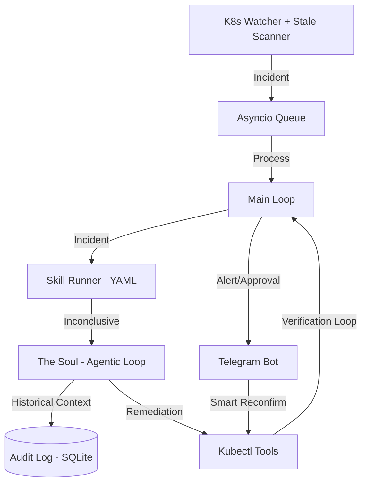
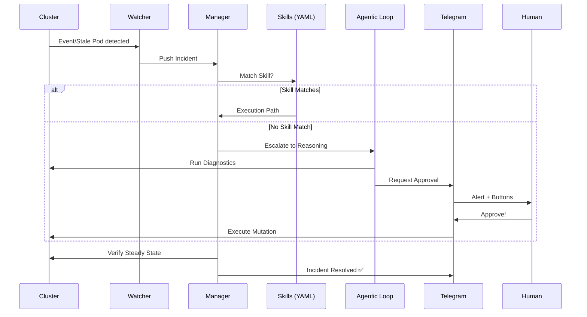

# Claw8s: Building a Hybrid-Brain SRE Agent from Scratch 🦅🛡️

*By Vin (Creator of Claw8s)*

In the world of Kubernetes, "Automation" usually means a collection of shell scripts, some prometheus alerts, and a pager that screams at you at 3 AM. But what if your infrastructure had its own **Soul**? What if it could not only detect a failure but reason about it, look at its own history, and fix it—all while you approve the final action from your phone while grabbing coffee?

This is why I built **Claw8s** (pronounced "Claws"). It’s a DIY experiment in autonomous SRE that bridges the gap between deterministic automation and agentic reasoning.

Check out the source here: [balamuru/claw8s](https://github.com/balamuru/claw8s)

---

## Why DIY? The Quest for a Better SRE

The motivation was simple: existing solutions were either too rigid (hardcoded scripts that break on novel errors) or too "black box" (expensive SaaS platforms that do magic behind a paywall). I wanted something that felt like a **Co-Pilot**, not a replacement.

I set out to build an agent that:
1. **Knows its Limits**: Use fast, cheap deterministic logic for known issues.
2. **Has a Soul**: Use LLM reasoning for the "weird" stuff.
3. **Never Forgets**: Maintain a persistent audit log to learn from past failures.
4. **Is Mobile-First**: SRE shouldn't require a laptop for every quick fix.

---

## The Anatomy of an Agent: Soul vs. Skills

The core innovation in Claw8s is the **Hybrid Brain**.

### Tier 1: The Skills (Deterministic Runbooks)
Most K8s errors are predictable. An `OOMKilled` pod usually needs more memory. A `CrashLoopBackOff` usually needs a log check. For these, I created **Skills**—YAML-defined runbooks that execute fixed investigation steps.

```yaml
# Example: OOMKilled Skill
name: "Memory Pressure Specialist"
trigger_reasons: ["OOMKilling"]
steps:
  - action: "get_pod_logs"
  - action: "get_deployment_status"
  - action: "suggest_remediation"
    params: { strategy: "vertical_scale" }
```

### Tier 2: The Soul (Agentic Reasoning)
When a Skill is inconclusive, the **Soul** takes over. This is an open-ended reasoning loop powered by LLMs (Claude, GPT, or Gemini). It has access to a toolbelt of `kubectl` operations and a strict mandate: **Stability above all else.**

It doesn't just run a command; it loops:
1. **Observe**: "Why is this pod pending for 7 minutes?"
2. **Reason**: "The node is at capacity, and the priority class is too low."
3. **Act**: "I'll suggest scaling the node group or lowering the request."
4. **Verify**: "I won't mark this resolved until the pod is `Ready`."

---

## The Component Layout: Organs of the Agent

Claw8s is built as a high-performance, asynchronous event processor. Here is how the "Organs" of the system interact:



### 📡 Sensory Cortex: The Watcher
Maintains a dual-path input stream. It consumes the live K8s Event API for sudden failures while running a proactive scanner every 30s to find "silent" zombies (e.g., pods stuck in `Pending` with no events).

### 🧠 Reasoning Loop: The Soul
A non-blocking agentic loop that uses multi-turn reasoning. It is the only component that can read the **Audit Log** to understand if a remediation has failed in the past, preventing "infinite restart loops."

### 🏛️ Relational Memory: The Auditor
A SQLite database running in **WAL mode** for high concurrency. It persists every turn, tool call, and result, providing the "Short-Term Memory" needed for context-aware commands.

### 🚥 Additional Organs:
*   **Asyncio Queue**: The "Spinal Cord" that decouples high-frequency watcher events from the relatively slow remediation and approval process.
*   **Manager (Main Loop)**: The orchestrator that manages incident state, runs the verification checks, and determines when an issue is truly "Resolved."
*   **Skills Runner**: A deterministic executor that parses YAML runbooks and executes investigation steps with zero LLM latency.
*   **Hardened Tools**: A strictly-typed registry of `kubectl` operations with built-in safety timeouts and namespace protection.
*   **Telegram Bot Controller**: The bridge to the human-in-the-loop, handling 64-byte callback compression and smart reconfirm logic.

### 🛡️ The Life Cycle of an Incident

To understand how Claw8s actually "thinks," we have to look at the sequence of a remediation:



---

## Battle Scars: Hard-Won Lessons

Building Claw8s wasn't all smooth sailing. We encountered several "Engineering Traps" that forced us to evolve:

### 1. The "Silent Failure" Trap
Initially, if a pod was stuck in `Pending` but didn't throw an event, the watcher was blind. We solved this by implementing a **Proactive Stale Pod Scanner** that sweeps the cluster every 30s for resources stuck in a "NotReady" state for over 2 minutes.

### 2. The Gemini Protocol Crisis
The Gemini API is extremely pedantic about multi-turn history. If an Assistant says it's calling a tool, the next message **MUST** match that tool name exactly. We had to build an **"Iron Shield" Sanitizer** in `llm.py` to force-scrub the history and inject fallback names to prevent `400 Bad Request` crashes.

### 3. The 64-Byte Telegram Limit
Telegram’s interactive buttons have a 64-character limit on callback data. We couldn't fit a full tool name + argument string in there.
**The Solution?** A **Callback Registry**. We hash the data, store it in the bot's memory, and only send the short hash to Telegram.

---

## Mobile-Driven SRE: Commander Overdrive

The proudest—and perhaps most dangerous—feature of Claw8s is the **Commander Overdrive (`/fix`)**. This is a direct, high-priority pipeline to the cluster's control plane.

### The Power of Implicit Context
The real magic isn't just that it understands natural language; it's that it has **Working Memory**. If the bot just alerted you about a crash in `web-app-deployment`, you don't need to type the full namespace and name. You just type:
> `/fix scale to 3`

The agent cross-references your instruction with the **Last Active Incident** in its memory, realizes you're talking about that specific deployment, and executes the fix instantly.

### With Great Power...
Because `/fix` commands come from a human, they **bypass all autonomous confidence thresholds**. The agent treats your word as law (100% confidence), making it an incredibly powerful tool for rapid remediation—but one that requires a steady hand at the keyboard. It turns the Telegram bot from a passive monitor into a live, mobile "Cluster Override" key.

```bash
$ kubectl get pods -n other
NAME                                  READY   STATUS    RESTARTS   AGE
web-app-deployment-6b47d8cc57-68fpb   1/1     Running   0          25m
web-app-deployment-6b47d8cc57-lr5sb   1/1     Running   0          25m
web-app-deployment-6b47d8cc57-sb6pb   1/1     Running   0          25m
```

---

## 🛠️ The Launch Sequence

Getting Claw8s online takes less than 2 minutes.

### 1. Configuration (`config.yaml`)
You can tune the agent's autonomy and monitoring focus:
```yaml
watcher:
  debounce_seconds: 30
agent:
  provider: openai
  model: gemini-1.5-flash
  auto_remediate_threshold: 0.85
```

### 2. Ignition
1. Install dependencies: `pip install -e .`
2. Set your `TELEGRAM_BOT_TOKEN` in `.env`.
3. Launch: `python main.py --config config.yaml`

For the full technical deep-dive and advanced deployment options, check out the **[Official README](https://github.com/balamuru/claw8s/blob/main/README.md)**.

---

## Final Thoughts

Claw8s proves that you don't need a massive enterprise team to build sophisticated autonomous infrastructure. By combining the precision of deterministic YAML with the intuition of LLMs, we've created a system that is paranoid, stable, and incredibly easy to manage from a smartphone.

The journey from a "Silent Cluster" to an "Active Defender" is complete.

**Join the defense at [https://github.com/balamuru/claw8s](https://github.com/balamuru/claw8s)** 🛡️🦅🚀
